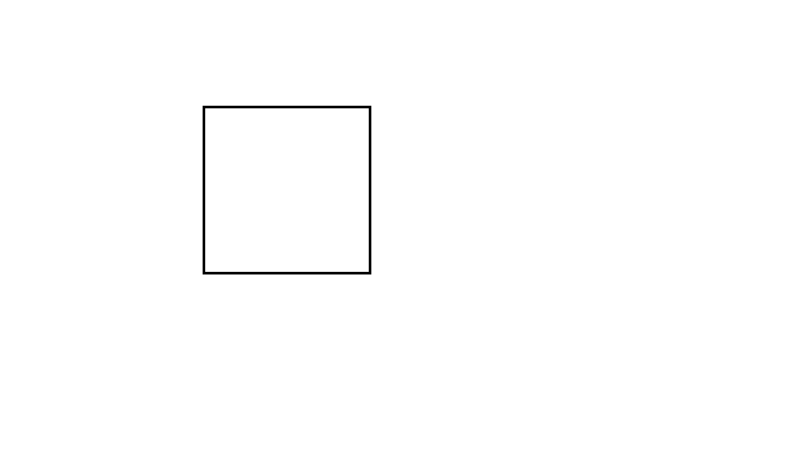

В ходе работы был реализован алгоритм детектирования углов Харриса с обязательным использованием текстурной памяти и аппаратного ограничения границ.   Тестирование на изображении чёрного квадрата показало время выполнения ~250 мс на CPU и ~4 мс на GPU при полном совпадении карт углов. Ускорение обусловлено архитектурой GPU: тысячи вычислительных ядер одновременно обрабатывают разные пиксели, тогда как CPU делает это последовательно. Дополнительно текстурная память выступает аппаратным кэшем, сокращая задержки при чтении соседних пикселей, а аппаратный clamp убирает условные переходы (if/else) на границах изображения, что минимизирует расхождение потоков внутри варпов и позволяет ядру работать с максимальной пропускной способностью.
Входное изображение:

