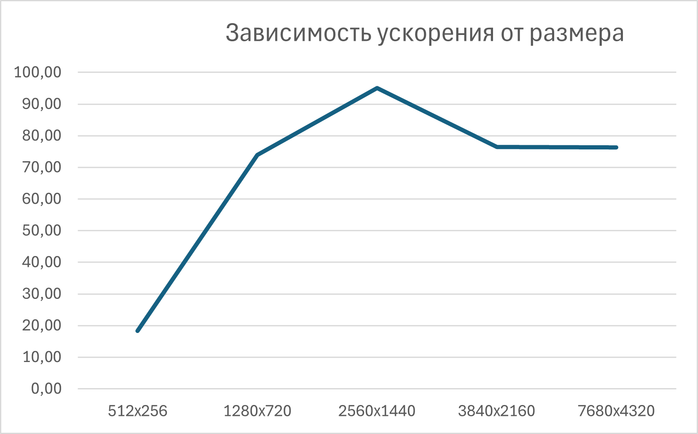

В ходе работы был реализован алгоритм билатеральной фильтрации изображений с обязательным использованием текстурной памяти и аппаратного ограничения границ.   
Тестирование на изображениях различных размеров показало ускорение 50-95 раз при обработке на GPU по сравнению с CPU. На малых разрешениях (512×256) ускорение составило ~18x, на средних (2560×1440) — до 95x, на больших (7680×4320) — стабилизировалось на уровне 76x. Ускорение обусловлено архитектурой GPU: тысячи вычислительных ядер одновременно обрабатывают разные пиксели, тогда как CPU выполняет вложенные циклы последовательно. Дополнительно текстурная память выступает аппаратным кэшем, эффективно загружая соседние пиксели для окна 3×3, а аппаратный clamp устраняет условные переходы на границах изображения, что минимизирует расхождение потоков внутри варпов и обеспечивает высокую пропускную способность памяти

